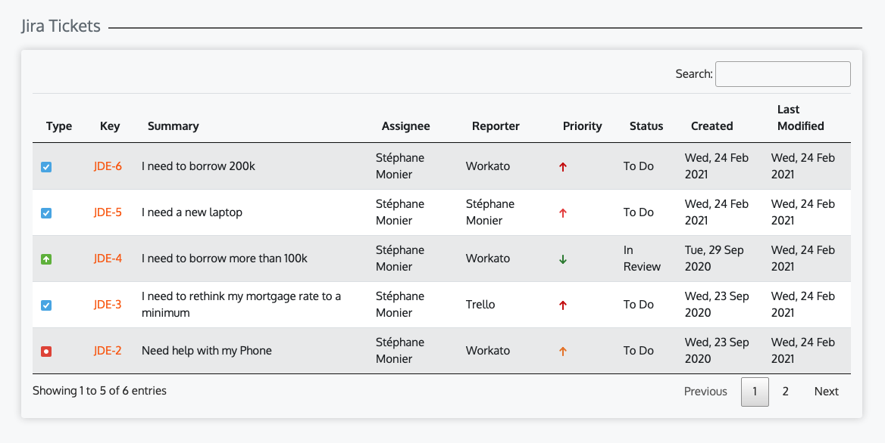

# JIRA Software Ticket List 

## Jahia 8 module

Display a datatable with all the Jira Issues from https://<YOUR_INSTANCE_NAME>.atlassian.net/jira/software/c/projects/<YOU_PROJECT_NAME>/issues/

The INSTANCE_NAME & PROJECT_NAME are part of the component definition
## Installation

Download the code source on github, recompile the module locally, and deploy the module through your Jahia Modules administration panel

```bash
mvn clean install
```

## Configuration
<YOUR_INSTALL_DIR>/digital-factory-data/karaf/etc/org.jahia.se.modules.jiraportalclient.taglibs.JiraIssueList.cfg
You'll need to specify:
```bash
jiraLogin=<JIRA_SOFTWARE_USERNAME>
jiraToken=<JIRA_SOFTWARE_API_TOKEN>
```
### screenshots



